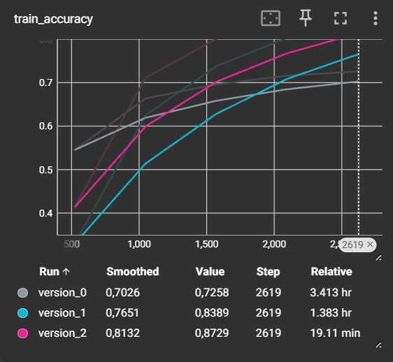
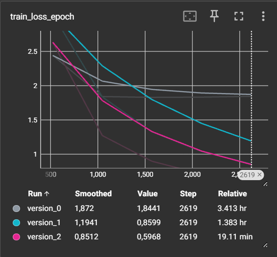
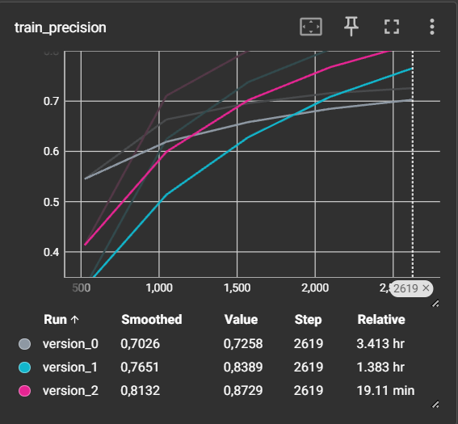

# Projekt na zaliczenie przedmiotu Computer vision

### Tytuł: Znaki drogowe - wykrycie i klasyfikacja
### Autor: Szymon Kwidzinski

## Cel projektu:
Celem projektu jest stworzenie aplikacji, która może zostać użyta w rozpoznawaniu
znaków drogowych na zdjęciu wykonanym w kabinie samochodu. Systemy inteligentne w samochodach stopniowo stają
się coraz bardziej dostępne i rozbudowane. Szczególnie dużym zainteresowaniem cieszą się
systemy wspomagające kierowcę w tym między innymi system rozpoznawania znaków drogowych. 
Wiele wypadków drogowych spowodowanych jest przeoczeniem i niedostateczną wiedzą na temat
mijanych na drodze znaków drogowych. Prędkość i inne czynniki rozpraszających kierowcę podczas
jazdy sprawiają, że ludzie prowadzący samochody mają problem z dostatecznie szybkim zinterpretowaniem oznakowania.
Rozpoznając znak drogowy, samochód mógłby w porę ostrzec kierowcę o mijanym znaku. Takie rozwiązanie jest też niezbędne
do funkcji autonomicznych aut. Znaki drogowe mają określone kształty i kolory a niektóre z nich posiadają również symbol,
który może służyć do ich identyfikacji. Problem detekcji znaków jest dużo trudniejszy niż klasyfikacja, ponieważ nie tylko
musimy wskazać co to za znak, ale również miejsce, w którym się on znajduje.

## Opis projektu:
Najnowsze technologie oraz rozwój sztucznej inteligencji pozwalają na wykrywanie i rozpoznawanie klas obiektów. Zaprojektowany program ma na celu znajdowanie znaków drogowych na podanych zdjęciach, zaznaczenie ich oraz wypisywanie ich oznaczenia zgodnie z zapisem w przepisach ruchu drogowego. Program do szkolenia sieci  wykorzystuje dataset z Kaggle’a ["polish traffic signs dataset"](https://www.kaggle.com/datasets/kasia12345/polish-traffic-signs-dataset
) autorstwa Kasia12345. Zawiera on 92 klasy Polskich znaków drogowych podzielonych na część treningową i testową. Do klasyfikacji znaków można wybrać jeden z trzech modeli sieci: TSNet zrobiony na wzór VGG16 oraz wstępnie trenowanych SqueezeNet 1.1 lub ResNet-18. Do wykrywania znaków jest wykorzystywana cascada z githuba [„Traffic-Sign-Localization-and-Recognition”](https://github.com/zahid58/Traffic-Sign-Localization-and-Recognition/blob/master/cascade.xml) autorstwa zahid58. Zostały też wykorzystane liczne zdjęcia ze znakami drogowymi znalezione w internecie.

## Wykresy
Wykresy zrobione w Tensorboard, epoch = 5, CPU, komenda w terminalu: python -m tensorboard.main --logdir=.\lightning_logs\model

## Język kodu:
Python 3.11

## Biblioteki:
(również zawarte w pliku requirements.txt)
* torch
* numpy
* matplotlib
* sys
* torchvision
* liczne podbiblioteki torch

## Dodatkowe pliki:
* signTnames.csv
* pliki modelów(no juź nie bo Github nie pozwala...) oraz moduły
* cascade.xml
* foldery zdjec archive8 (dataset z Kaggle) oraz test-images

## Uruchomienie:
Po ściągnięciu kodu, modułów oraz pliku ze zdjęciami i załadowaniu powyższych bibliotek, należy najpierw uruchomić "kaggledownload.py" w środowisku python, po czym można uruchomić "projektCOV.py". Pierwszy skrypt pobiera dataset z Kaggle'a i wrzuca go do odpowiedniego folderu, potrzebny jest tylko jeśli projekt był pobierany po raz pierwszy. Główny kod po uruchomieniu będzie zatrzymywał się na kolejnych
zdjęciach i wznawiał działanie po zamknięciu zdjęcia. Każde zdjęcie z zaznaczonymi znakami będzie 
zapisane na dysku, z którego został uruchomiony kod i zdjęcie. Program jest interaktywny i możliwe
jest wybranie opcji w terminalu w danych krokach np. wyjście z programu czy wybór modelu sieci.
By wyświetlić wykresy, należy w terminalu użyć komendy "python -m tensorboard.main --logdir=.\lightning_logs\model".

### UWAGA !!! Github nie pozwolił na wysłanie plików modeli, przy pierwszym uruchomieniu programu należy więc je utworzyć poprzez interakcje. Ponieważ ograniczenia spowodowały, że program jest na CPU, a nie na GPU, należy mieć na uwadze, że epoch'y mogą trwać trochę czasu (TSNet na jedną potrzebuje 20-30 minut...). Na obecny moment to jedyne rozwiązanie, może uda mi się wrzucić przetrenowane modele na Github'a.

## Źródła i inspiracje : 
* materiały z przedmiotów : NAJ, IML, FDL, COV
* ["polish traffic signs dataset"](https://www.kaggle.com/datasets/kasia12345/polish-traffic-signs-dataset) autorstwa Kasia12345
* [„Traffic-Sign-Localization-and-Recognition”](https://github.com/zahid58/Traffic-Sign-Localization-and-Recognition/blob/master/cascade.xml) autorstwa zahid58
* liczne zdjęcia znaków drogowych
